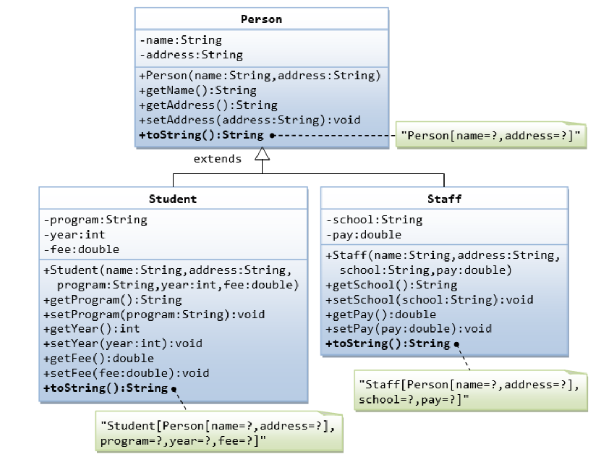
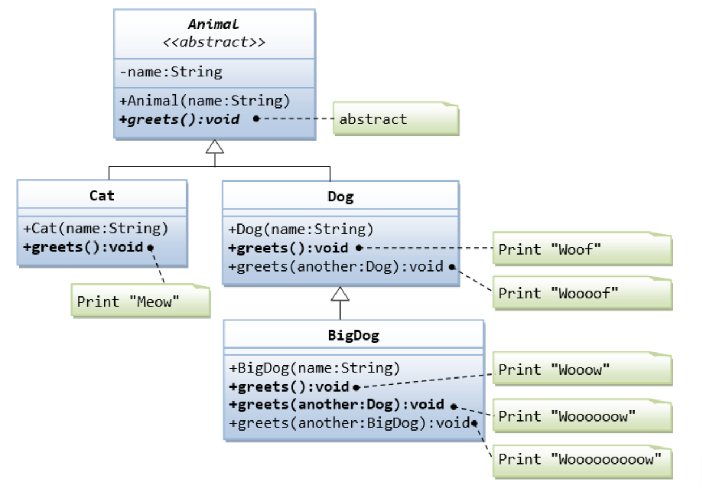

## Exam 

**Task 1:** 
- What is the difference between a `List<T>` and an Array?
- В чем разница между списком (`List<T>`) и массивом?
- Фарқ байни рӯйхат (`List<T>`) ва массив чӣ аст?

---    

**Task 2:**
  - What is inheritance?
  - Что такое наследование?
  - Мерос чист?
    
---

**Task 3:**
  - What is Polymorphism and Virtual Methods?
  - Что такое Полиморфизм и Виртуальные Методы?
  - Полиморфизм ва Методи Виртуалӣ чист?
    
---

**Task 4:**
  - What is Abstract classes and Abstract methods?
  - Что такое Абстрактные классы и Абстрактные методы?
  - Класси абстрактӣ ва Методи абстрактӣ чист?
 
---

**Task 5:** 



---

**Task 6:** 



---

**Task 7:** 
```csharp
List<int> list = new List<int>() {1, 0, 5, -4, 5, 10 ,-80, 24, 0, -4, 100, 24, 45, 6, -1};
```
1. 🧩 Displays the largest number from a list.

2. 🗑️ Remove all duplicate elements from the list.

3. 🔢 Sort it in ascending order.

4. 🔀 Replace all negative numbers with 0.

   
**Task 7:**
```csharp
List<int> list = new List<int>() {1, 0, 5, -4, 5, 10 ,-80, 24, 0, -4, 100, 24, 45, 6, -1};
```

1. 🧩 Выводит на экран наибольшее число из списка.

2. 🗑️ Удалите все повторяющиеся элементы из списка.

3. 🔢 Отсортируйте его в порядке возрастанию.

4. 🔀 Замените все отрицательные числа на 0.            

**Task 7:**
```csharp
List<int> list = new List<int>() {1, 0, 5, -4, 5, 10 ,-80, 24, 0, -4, 100, 24, 45, 6, -1};
```

1. 🧩 Адади калонтаринро аз рӯйхат бароред.

2. 🗑️ Ҳама рақамҳои такрор шударо аз рӯйхат тоза кунед.

3. 🔢 Онро бо тартиби афзоиш мураттаб кунед.

4. 🔀 Ҳама рақамҳои манфиро бо 0 иваз кунед.

